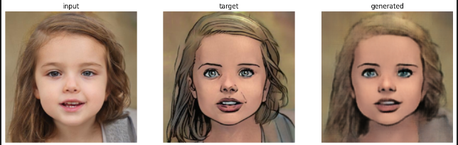

---

# Pix2Pix Image-to-Image Translation

[](https://pytorch.org/)
[](https://www.python.org/)
[](https://opensource.org/licenses/MIT)

A PyTorch implementation of **pix2pix**, a conditional Generative Adversarial Network (cGAN) for general-purpose image-to-image translation. This project recreates the seminal work "[Image-to-Image Translation with Conditional Adversarial Networks](https://arxiv.org/abs/1611.07004)" by Isola et al. (2018).


*Example of image-to-image translation tasks (Source: Original paper)*

## Project Overview

Pix2pix is a framework that learns a mapping from input images to output images using paired data. It has been successfully applied to various tasks, including:

- **Semantic Segmentation** 🖼️→🏷️
- **Map to Aerial Photo** 🗺️→🛰️
- **Black & White to Color** ⚫⚪→🌈
- **Edges to Photo** ✏️→📷
- **Day to Night** ☀️→🌙
- **Sketch to Portrait** 🎨→👨‍🎨

This implementation provides a clean, well-documented recreation of the pix2pix model using PyTorch, making it accessible for learning and experimentation.

## 🛠️ Installation & Setup

### Prerequisites

- Python 3.8+
- CUDA-capable GPU (recommended for training)
- PyTorch

### Installation

1. **Clone the repository:**
```bash
git clone https://github.com/Hemanth2332/pix2pix-recreation.git
cd pix2pix-recreation
```

2. **Create a virtual environment (recommended):**
```bash
python -m venv venv
source venv/bin/activate  # On Windows: venv\Scripts\activate
```

3. **Install dependencies:**

```bash
pip install torch torchvision torchaudio matplotlib pillow numpy opencv-python tqdm tensorboard
```
*It is recommended to install gpu compatible torch version*

## 🚀 Usage

### 1. Data Preparation

The model requires paired datasets where each input image has a corresponding target output image.

**Dataset Structure:**
```
dataset/
├── train/
│   ├── input/
│   │   ├── image1.jpg
│   │   ├── image2.jpg
│   │   └── ...
│   └── target/
│       ├── image1.jpg
│       ├── image2.jpg
│       └── ...
└── val/
    ├── input/
    └── target/
```

**Popular datasets for pix2pix:**
- [Facades](https://people.eecs.berkeley.edu/~tinghuiz/projects/pix2pix/datasets/facades.tar.gz)
- [Maps](https://people.eecs.berkeley.edu/~tinghuiz/projects/pix2pix/datasets/maps.tar.gz)
- [Edges to Shoes/Handbags](https://people.eecs.berkeley.edu/~tinghuiz/projects/pix2pix/datasets/edges2shoes.tar.gz)


**Key Training Parameters:**
- `dataset_path`: Path to your dataset
- `epochs`: Number of training epochs (default: 200)
- `batch_size`: Batch size (default: 1)
- `lr`: Learning rate (default: 0.0002)
- `lambda_l1`: L1 loss weight (default: 100)


## 🏗️ Model Architecture

### Generator (U-Net)
- **Type:** Encoder-Decoder with skip connections
- **Input:** Source image (e.g., edges, semantic map)
- **Output:** Translated image (e.g., photo, color image)
- **Skip Connections:** Preserve low-level information between encoder and decoder

### Discriminator (PatchGAN)
- **Type:** Convolutional classifier
- **Input:** Concatenated source and target images OR source and generated images
- **Output:** Patch of probabilities representing real/fake classification per image patch
- **Receptive Field:** 70×70 patches (original paper)

## ⚙️ Training Details

### Loss Function
The model combines two loss functions:

```
Total Loss = Adversarial Loss + λ × L1 Loss
```

- **Adversarial Loss:** Standard GAN loss from the discriminator
- **L1 Loss:** Encourages pixel-wise similarity between generated and target images
- **λ:** Weight parameter (typically 100)

### Training Strategy
- **Optimizer:** Adam (β₁=0.5, β₂=0.999)
- **Learning Rate:** 0.0002 (constant for first 100 epochs, then linear decay)
- **Batch Normalization:** Used in both generator and discriminator
- **Instance Normalization:** Alternative for better stability

## 📊 Results & Evaluation

The model saves generated samples at regular intervals during training.

### Qualitative Evaluation


## 🎯 Key Features

- ✅ **U-Net Generator** with skip connections
- ✅ **PatchGAN Discriminator** for high-frequency structure
- ✅ **Conditional GAN training** with paired data
- ✅ **L1 loss** for pixel-wise similarity
- ✅ **Modular code structure** for easy experimentation
- ✅ **Training monitoring** with sample generation

## 🔮 Future Enhancements

- [ ] Multi-GPU training support
- [ ] TensorBoard integration for better visualization
- [ ] Pre-trained models for common datasets
- [ ] Web demo with Gradio/Streamlit
- [ ] Support for additional loss functions (e.g., perceptual loss)
- [ ] CycleGAN extension for unpaired image translation

## 🤝 Contributing

Contributions are welcome! Please feel free to submit a Pull Request. For major changes, please open an issue first to discuss what you would like to change.

1. Fork the project
2. Create your feature branch (`git checkout -b feature/AmazingFeature`)
3. Commit your changes (`git commit -m 'Add some AmazingFeature'`)
4. Push to the branch (`git push origin feature/AmazingFeature`)
5. Open a Pull Request

## 📜 License

This project is licensed under the MIT License - see the [LICENSE](LICENSE) file for details.

## 🙏 Acknowledgments

- **Phillip Isola et al.** for the original [pix2pix paper](https://arxiv.org/abs/1611.07004)
- **Jun-Yan Zhu** and **Taesung Park** for the PyTorch implementation reference
- **PyTorch** team for the excellent deep learning framework
- **Berkeley AI Research (BAIR)** for the original work and datasets

## 📚 References

- [Image-to-Image Translation with Conditional Adversarial Networks](https://arxiv.org/abs/1611.07004)
- [Official PyTorch Implementation](https://github.com/junyanz/pytorch-CycleGAN-and-pix2pix)
- [U-Net: Convolutional Networks for Biomedical Image Segmentation](https://arxiv.org/abs/1505.04597)

---

**⭐ If you find this project useful, please consider giving it a star on GitHub!**

---

